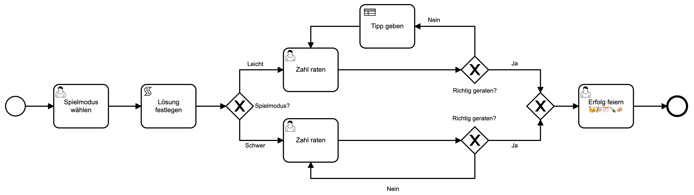

## Table of Contents

* [Camunda BPM Run](#camunda-bpm-run)
* [OpenAPI/Swagger Definition](#openapiswagger-definition)

## Camunda BPM Run

### Step 0: Download & Unpack

First, let's download and unpack [Camunda BPM Run].

You should see the following folder structure:

```
├── README.txt
├── configuration
│   ├── default.yml
│   ├── production.yml
│   ├── keystore
│   │   └── keystore.p12
│   ├── resources
│   ├── sql
│   └── userlib
│       └── h2-1.4.200.jar
├── internal
├── start.bat
└── start.sh
```

### Step 1: Deploy Resources

Place the BPMN file [`spiel-zahlen-raten.bpmn`](./assets/spiel-zahlen-raten.bpmn), 
the DMN file [`tipp-geben.dmn`](./assets/tipp-geben.dmn) and the HTML Form file 
[`zahl-raten.html`](./assets/zahl-raten.html) under `configuration/resources`.

### Step 2: Run

Start Camunda BPM by running the `./start.bat` (for Windows users) or 
`./start.sh` (for Unix-based systems).

Please watch out for the following lines since it means that the application has been started successfully:

```
Setting JAVA property to /Library/Java/JavaVirtualMachines/jdk1.8.0_131.jdk/Contents/Home/bin/java
REST API enabled
WebApps enabled
classpath: ./internal/webapps/,./internal/rest/,./configuration/userlib/,./configuration/keystore/
  ____                                 _         ____  ____  __  __   ____              
 / ___| __ _ _ __ ___  _   _ _ __   __| | __ _  | __ )|  _ \|  \/  | |  _ \ _   _ _ __  
| |    / _` | '_ ` _ \| | | | '_ \ / _` |/ _` | |  _ \| |_) | |\/| | | |_) | | | | '_ \ 
| |___| (_| | | | | | | |_| | | | | (_| | (_| | | |_) |  __/| |  | | |  _ <| |_| | | | |
 \____/\__,_|_| |_| |_ \__,_|_| |_ \__,_|\__,_| |____/|_|   |_|  |_| |_| \_\\__,_|_| |_|

  Spring-Boot:  (v2.2.5.RELEASE)
  Camunda BPM: (v7.13.0)
...
2020-03-03 11:41:15.801  INFO 9848 --- [           main] o.c.b.r.CamundaBpmRun : Started CamundaBpmRun in 8.318 seconds (JVM running for 9.259)
2020-03-03 11:41:15.803  INFO 9848 --- [           main] o.c.b.e.jobexecutor   : ENGINE-14014 Starting up the JobExecutor[org.camunda.bpm.engine.spring.components.jobexecutor.SpringJobExecutor].
2020-03-03 11:41:15.804  INFO 9848 --- [ingJobExecutor]] o.c.b.e.jobexecutor   : ENGINE-14018 JobExecutor[org.camunda.bpm.engine.spring.components.jobexecutor.SpringJobExecutor] starting to acquire jobs
...
```

### Step 3: Open the Webapps & REST API

Go to [http://localhost:8080/](http://localhost:8080/) to see if the Webapps are present. 
You should see the Login screen of the Webapps.

Go to [http://localhost:8080/engine-rest/engine](http://localhost:8080/engine-rest/engine) to see if 
the REST API is present. You should see a response similar to this one:
```json
[{"name":"default"}]
```

### Step 4: Start a Process Instance

Let's start a new process instance:
1. Go to Tasklist [http://localhost:8080/camunda/app/tasklist/default/](http://localhost:8080/camunda/app/tasklist/default/)
2. Login with "demo" as username and "demo" as password
3. Click on "Start process" & select `spiel-zahlen-raten`
5. Click on the button "Start"
6. Go to Cockpit [http://localhost:8080/camunda/app/cockpit/default/](http://localhost:8080/camunda/app/cockpit/default/)
   * In Cockpit, click on "Processes" in the top navigation
   * Click on `spiel-zahlen-raten` to monitor the just started process

## OpenAPI/Swagger Definition

Let's generate a Camunda BPM GO Client to modify the running process instance. The goal is to
move the Token waiting in "Zahl raten" to "Tipp geben".

### Step 0: Install OpenAPI Generator

Make sure to install the [OpenAPI Generator](https://openapi-generator.tech/docs/installation).
I'm using the node.js one in this example.

### Step 1: Generate a Camunda BPM Client

1. My favorite programming language is "GO" so I pick that one
2. Make sure to set the environment variable `$GOPATH`
3. Run 
   ```
   npx @openapitools/openapi-generator-cli generate -i https://start.camunda.com/openapi.json \
       -g go -o $GOPATH/src/openapi --skip-validate-spec
   ```

### Step 2: Modify a Process Instance using GO

1. Copy the process instance id of the process
2. Run `go run openapi-client-modify.go ADD_YOUR_PROCESS_INSTANCE_ID_HERE`

If everything went well, the command should produce the following result:

```
Modifikation erfolgreich!
```

### Step 3: Go to Cockpit to Review the Modification

If you go to Cockpit to the Process Definition view, you should see that the Token has moved.

[Camunda BPM Run]: https://downloads.camunda.cloud/release/camunda-bpm/run/7.13/camunda-bpm-run-7.13.0.zip